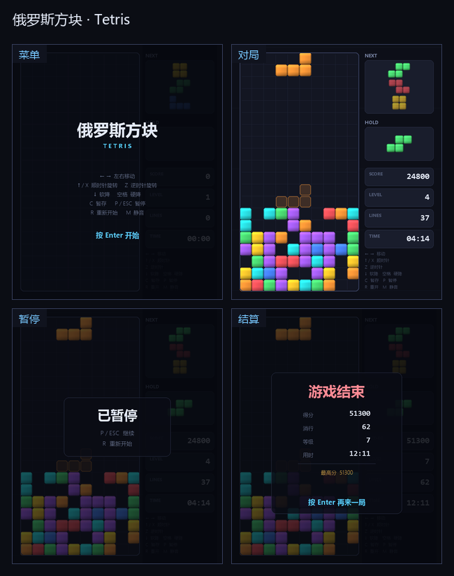
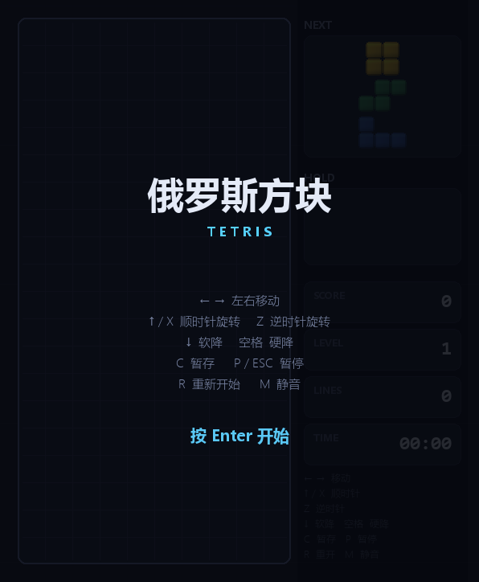
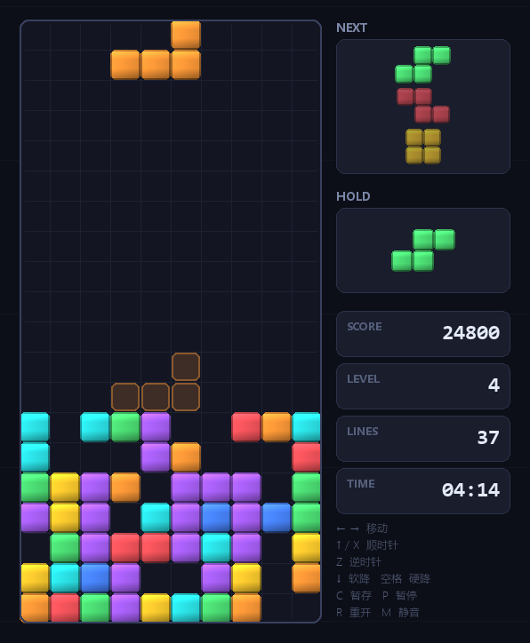
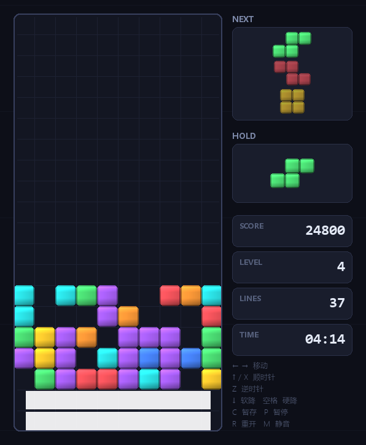
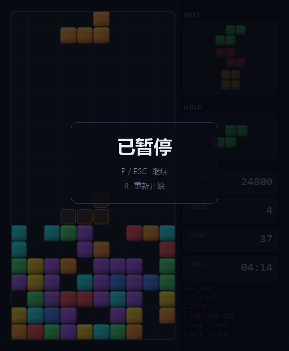
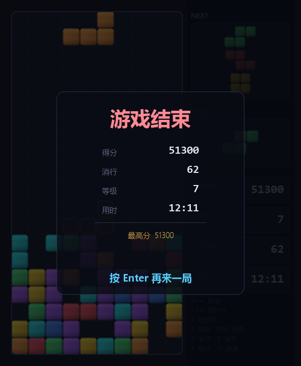

# 俄罗斯方块 Tetris

一个用 pygame 写的俄罗斯方块。单文件、**零外部素材** —— 方块是逐像素画的，音效由 numpy 现场合成波形（没有 numpy 就自动静音），clone 下来就能跑。


## 预览



| 菜单 | 对局 | 消行动画 |
| :---: | :---: | :---: |
|  |  |  |

| 暂停 | 结算 |
| :---: | :---: |
|  |  |

## 快速开始

```bash
git clone https://github.com/201634924cyh/tetris.git
cd tetris
```

然后选一种方式启动：

| 平台 | 命令 |
| --- | --- |
| Windows | 双击 `run.bat` |
| macOS / Linux | `sh run.sh` |
| 任意平台手动 | `pip install -r requirements.txt` 然后 `python tetris.py` |

启动脚本会自己找 Python、缺 pygame 就自动装（走清华镜像），首次运行不会卡住。找解释器时**优先选已经装了 pygame 的那个** —— 机器上同时存在多个 Python 时不用你操心。

> 没有官方 pygame wheel 的 Python 版本（如 3.14）会自动改装 `pygame-ce` —— 社区分支，API 兼容，装完同样是 `import pygame`。

## 玩法

| 操作 | 说明 |
| --- | --- |
| `←` `→` | 左右移动（长按连发） |
| `↑` / `X` | 顺时针旋转 |
| `Z` / `Ctrl` | 逆时针旋转 |
| `↓` | 软降（按住持续加速） |
| `空格` | 硬降（直接落底并锁定） |
| `C` / `Shift` | Hold 暂存当前方块 |
| `P` / `Esc` | 暂停 / 继续 |
| `R` | 重开一局 |
| `M` | 静音开关 |
| `F11` / `+` / `-` | 全屏 / 缩放窗口 |

## 实现要点

不是"能左右移动就算数"的简版，几个决定手感的地方都按现代方块的标准做了：

| 特性 | 说明 |
| --- | --- |
| **SRS 旋转系统** | 完整的官方超级旋转系统，含 JLSTZ 与 I 两套踢墙表（共 5 组偏移）。贴墙、贴地形旋转都能踢出来，不会出现"明明有空间却转不动" |
| **T-Spin 判定** | 按 T 块旋转中心四个角被占≥3 个判定，有独立计分与提示 |
| **7-bag 随机器** | 每 7 个方块内 7 种各出现一次，避免连续来 6 个 S 的恶性手感 |
| **锁定延迟** | 落地后还有 0.5s 可以微调，移动/旋转会重置倒计时（上限 15 次，防无限拖延） |
| **DAS / ARR** | 长按左右先等 150ms 再连发，连发间隔 45ms —— 少了这两个参数方块会显得很"木" |
| **Hold + Next×3** | 暂存方块（每次落地限用一次）、右侧预览后三个 |
| **幽灵落点** | 半透明预览当前方块会落在哪 |
| **消行动画** | 白闪 + 逐格粒子爆散 + 屏幕震动 + 闪光，行数越多震得越狠 |
| **程序化图形** | 每个方块是逐像素画的（顶面受光、底部成影），不依赖任何图片文件 |
| **程序化音效** | 方波/正弦波现场合成，含消行、旋转、T-Spin、升级等音色；无 numpy 或无声卡时整体静音降级 |
| **自由缩放** | 内部是固定逻辑画布（596×724），窗口可任意拉伸/全屏，按等比缩放呈现，鼠标坐标反缩放回逻辑坐标 |

### 手感参数

全部集中在 `tetris.py` 顶部配置区，改完直接跑自检即可确认没改坏：

| 参数 | 值 | 含义 |
| --- | --- | --- |
| `DAS` | 0.150 s | 长按后开始连发前的延迟 |
| `ARR` | 0.045 s | 连发间隔 |
| `SOFT_DROP_INTERVAL` | 0.040 s | 软降每格耗时 |
| `LOCK_DELAY` | 0.500 s | 落地后还能操作多久 |
| `MAX_LOCK_RESETS` | 15 | 锁定倒计时的重置次数上限 |
| `CLEAR_DURATION` | 0.30 s | 消行动画时长 |
| `GRAVITY` | 0.80 → 0.017 s/格 | 每级下落间隔（共 20 级） |

### 计分

所有基础分都会乘以当前等级（`level`）。等级 = 累计消行数 ÷ 10 + 1。

| 消行 | 基础分 | | T-Spin | 基础分 |
| :---: | ---: | --- | :---: | ---: |
| SINGLE ×1 | 100 | | T-Spin 无消行 | 400 |
| DOUBLE ×2 | 300 | | T-Spin ×1 | 800 |
| TRIPLE ×3 | 500 | | T-Spin ×2 | 1200 |
| TETRIS ×4 | 800 | | T-Spin ×3 | 1600 |

另外：硬降每格 **2 分**；连击额外 **50 × (连击数 − 1) × 等级**。

## 自检

```bash
python selftest.py
```

用 `SDL_VIDEODRIVER=dummy` 起虚拟显示，跑 **94 条断言**，覆盖：

- **状态机**：菜单 / 游玩 / 暂停 / 结束四条路径的全部分支，含结束态下输入失效、`Enter` 或 `R` 重开、重开后分数与棋盘清零、最高分保留。
- **SRS 踢墙**：构造贴墙与贴地形的盘面，逐条验证踢墙表命中的偏移量与最终位置。
- **消行与计分**：一次消 1 / 2 / 4 行的行数、分数、棋盘残留格数（这里抓到过一个真 bug，见下）；TETRIS 加分、连击累加、等级提升。
- **手感**：锁定延迟到时自动锁定、地面移动能重置倒计时、软降/硬降计分、DAS 连发节奏。
- **Hold / 7-bag**：暂存后换出的方块正确、同一落地周期不能连续暂存、每 7 个方块内 7 种各出现一次。
- **渲染**：五种状态各画一遍并截图，再做**像素级扫描** —— 棋盘内确有高饱和度方块色、侧栏卡片之间是背景色（说明没画歪）、暂停/结束遮罩确实把画面压暗、消行动画确实出现接近纯白的闪光行、画面无非预期暗斑。
- **缩放**：窗口↔画布坐标换算在多种窗口尺寸下都不错位。

自检会顺带把 README 用的截图重新生成到 `preview/`（总览图需要 Pillow，没装会自动跳过，不影响断言结论）。

游戏本身支持四个命令行参数，方便脚本化验证：

```bash
python tetris.py --frames 300     # 跑 300 帧后自动退出
python tetris.py --seed 42        # 固定随机种子，复现同一局
python tetris.py --dummy          # 用 dummy 视频/音频驱动（无窗口环境）
python tetris.py --scale 1.5      # 初始窗口缩放
```

## 项目结构

```
tetris/
├── tetris.py          # 游戏本体：配置、配色、音效、方块、游戏逻辑、渲染、应用外壳（单文件）
├── selftest.py        # 无窗口自检，94 条断言
├── run.bat            # Windows 启动脚本
├── run.sh             # macOS / Linux 启动脚本
├── requirements.txt   # 依赖（pygame 必需，numpy 可选）
├── preview/           # README 用的截图
├── LICENSE
├── .gitignore
└── .gitattributes
```

`tetris.py` 内部分成 8 节，节标题带注释分隔线，跳读很方便：

| 节 | 内容 |
| --- | --- |
| 1. 基础配置 | 格子尺寸、手感参数、重力表、计分常量 |
| 2. 配色 | 全部 `C_*` 颜色常量 |
| 3. 小工具 | 字体、文本、圆角矩形、方块贴图的程序化生成 |
| 4. 程序化音效 | 波形合成与 `Sfx` 播放器 |
| 5. 方块与随机器 | `Piece` / `Bag` / `Particle`、旋转矩阵 |
| 6. 游戏主体 | `Game` 类：碰撞、旋转、锁定、消行、计分、渲染 |
| 7. 应用外壳 | `App` 类：窗口、缩放、事件、主循环 |
| 8. 入口 | `main()` 与命令行参数 |

## 想改造的话，改这几个地方

| 想改什么 | 改哪里 |
| --- | --- |
| 手感（连发速度、锁定时间） | 顶部 `DAS` / `ARR` / `LOCK_DELAY` / `SOFT_DROP_INTERVAL` |
| 下落速度曲线 | `GRAVITY` 列表（20 级）与 `LINES_PER_LEVEL` |
| 计分规则 | `SCORE_LINES` / `SCORE_TSPIN` / `SCORE_TSPIN_MINI`，以及 `_apply_clear()` |
| 格子大小 / 棋盘尺寸 | `CELL`、`COLS`、`ROWS`（画布尺寸 `CANVAS_W/H` 会自动跟着算） |
| 配色 | 第 2 节的 `C_*` 常量与 `PIECE_COLORS` |
| 方块手感（旋转矩阵、踢墙） | `MATRICES`、`KICKS_JLSTZ`、`KICKS_I` |
| 随机器（改成纯随机 / 带权随机） | `Bag.next()` |
| 消行动画与粒子 | `_burst()`、`_draw_flash()`、`CLEAR_DURATION` |
| 音效音色 | `Sfx` 的 `sounds` 字典与合成用的 `_tone_data()` / `_seq()` |
| 中文字体 | `_FONT_FAMILIES` / `_MONO_FAMILIES` 字体族候选列表（按名匹配系统字体，已含 Win / macOS / Linux 常见中文字体） |
| 界面布局（侧栏卡片） | `_draw_panel()` 与 `PANEL_W` |
| 加新玩法（如 40 行冲刺、垃圾行） | `Game` 的状态机与 `update()` |

## 已知取舍

- **没有实现 SRS 的 T-Spin Mini 与"踢墙次数"细分**。`SCORE_TSPIN_MINI` 常量已备好，但当前判定逻辑只区分"是否 T-Spin"，不区分 mini / 完整。
- **没有 Back-to-Back 连击加成**。连续 TETRIS / T-Spin 不会有额外倍率。
- **没有"下一个方块"以外的序列预览**（不能看 5 个之后）。
- **没有回放、没有存档**，最高分只存在内存里，关掉窗口就丢。
- **消行动画期间不接受输入**（约 0.3s），这是刻意的 —— 让消除有节奏感，代价是极高速堆叠时会有轻微操作延迟。
- 音效需要 numpy；缺失时整体静默降级，功能不受影响。
- **窗口宽度低于约 400px 时文字会糊** —— 布局按固定比例缩放。

## 许可

[MIT](LICENSE)
